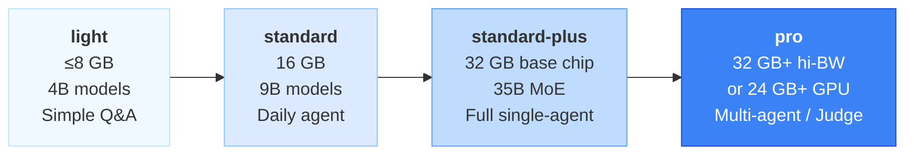
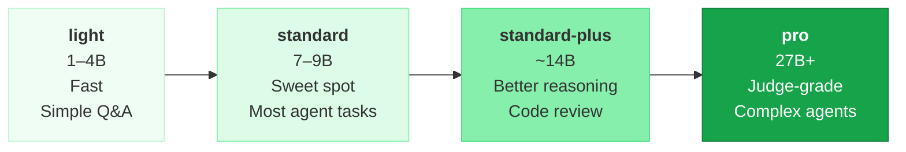
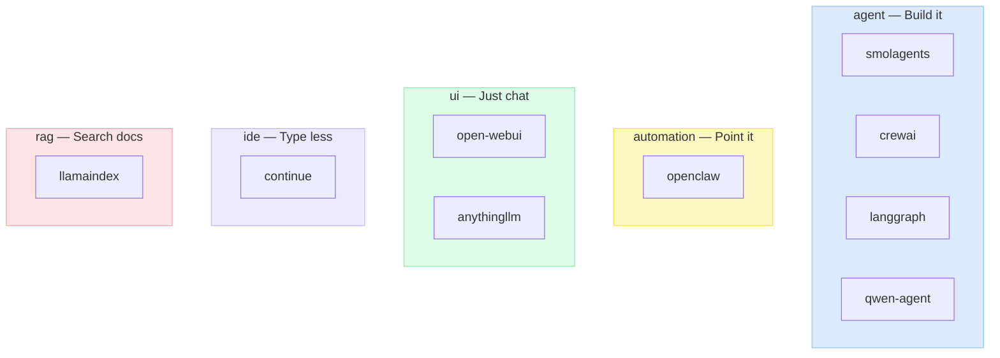
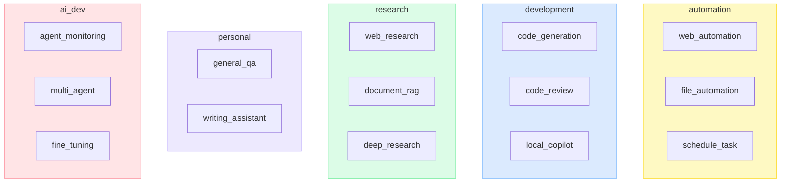
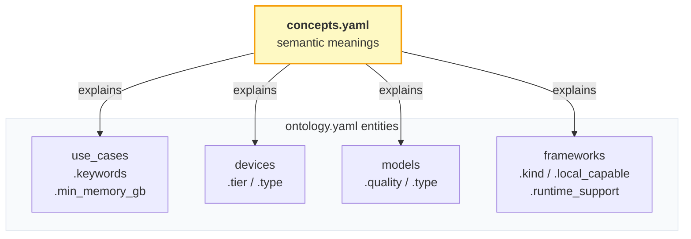

# Concept Guide

> This document explains **what ontology values mean** — the semantic layer
> on top of the structural schema.
>
> Machine-readable version: [`../concepts.yaml`](../concepts.yaml)
> Structural contract: [`agent-setup-copilot/governance/GOVERNANCE.md`](https://github.com/WMJOON/agent-setup-copilot/blob/main/governance/GOVERNANCE.md)

---

## Why concepts matter

The schema tells you `tier` must be one of `light | standard | standard-plus | pro`.
The concept tells you **what that actually means in practice**:

> `standard-plus` = 32 GB memory with a base chip.
> Runs MoE models like qwen3.5:35b-a3b at 18-25 t/s.
> Covers all single-agent use cases. Best price-to-capability sweet spot in 2026.

Without concepts, contributors could add `tier: pro` to an 8 GB device, or
`quality: standard` to a 32B model, and the schema validator would not catch it.
Concepts are the guide that makes contributions consistent.

---

## Device Concepts

### `tier` — Practical Capability Bracket

Tier answers: **"What class of agent workloads can this device handle reliably?"**

| Tier | Memory | Bandwidth | Max practical model | Use case coverage |
|------|--------|-----------|--------------------|--------------------|
| `light` | ≤8 GB | any | 4B class | Autocomplete, simple tasks |
| `standard` | 16 GB | any | 9B class | Most single-agent tasks |
| `standard-plus` | 32 GB | ≤150 GB/s | MoE 35B class | Full single-agent |
| `pro` | 32 GB+ | ≥273 GB/s, or GPU | 27B+ dense | Multi-agent, Judge, fine-tune |

### `type` — Form Factor

| Type | Key characteristic |
|------|--------------------|
| `macbook` | Portable. Fan-throttling risk on sustained inference. |
| `mac-mini` | Stationary, quiet. Ideal always-on server. |
| `mac-studio` | Highest bandwidth Apple Silicon. |
| `pc` | Discrete GPU available. Best for fine-tuning (CUDA). |

### `max_model`

The Ollama model that runs at **interactive speeds** (≥10 t/s) on this device
using Q4_K_M quantization. Not the absolute maximum — the practical ceiling.

---

## Model Concepts

### `quality` — Output Capability Bracket

Quality is calibrated to **agent use cases**, not just benchmark scores.
A model that scores well on MMLU but fails at structured tool calls is not `standard`.

| Quality | Parameter range | Characteristic |
|---------|----------------|---------------|
| `light` | 1–4B | Fast. Limited multi-step reasoning. |
| `standard` | 7–9B | Reliable tool calling. Most agent tasks. |
| `standard-plus` | ~14B | Noticeably better code and reasoning. |
| `pro` | 27B+ or MoE equiv. | LLM-as-Judge quality. Complex agents. |

### `type` — Architecture

| Type | Memory usage | Speed characteristic |
|------|-------------|---------------------|
| `dense` | Proportional to params | Limited by memory bandwidth |
| `MoE` | Full model in RAM, only fraction active | Runs at active-param speed, not total-param speed |

**MoE example**: `qwen3.5:35b-a3b` has 35B total params but activates only 3B per token.
It fits in 32 GB (like a 35B model) but runs at ~20 t/s (like a 9B model).

### `tool_calling`

**Required `true` for agent use.** Frameworks like smolagents, crewai, and openclaw
depend on structured function calls. A model with `tool_calling: false` should
only be recommended for `ui` or `ide` kind frameworks.

### `sweet_spot`

Marks the best quality-to-resource ratio in a tier.
When multiple models fit a device, the copilot recommends `sweet_spot: true` first.

---

## Framework Concepts

### `kind` — Framework Role

| Kind | You write code? | Primary output | When to recommend |
|------|----------------|---------------|------------------|
| `agent` | Yes | Custom agent behavior | User wants to build something |
| `automation` | Minimal | Automated tasks | User wants "do this for me" |
| `ui` | No | Chat interface | User wants a local ChatGPT |
| `ide` | No (plugin) | Code completions | User wants Copilot replacement |
| `rag` | Yes | Document Q&A | User has many documents to search |

### `local_capable`

**The most important field for privacy-conscious users.**

`true` → works entirely on-device with Ollama. No data leaves the machine.
`false` → requires a cloud API key, even if using a local model for inference.

### `runtime_support`

Which LLM backends the framework connects to. Used to filter frameworks
that are compatible with the user's setup (Ollama only vs API available).

| Value | Setup required |
|-------|---------------|
| `ollama` | `ollama serve` running locally |
| `openai` | `OPENAI_API_KEY` env var |
| `anthropic` | `ANTHROPIC_API_KEY` env var |
| `huggingface` | `HF_TOKEN` or local Transformers install |
| `litellm` | `pip install litellm` + any provider key |
| `any` | Any OpenAI-compatible URL (includes Ollama's `/v1` endpoint) |

### `complexity`

| Level | Lines to first working agent | Who it's for |
|-------|------------------------------|-------------|
| `low` | <10 | Anyone. Copy-paste and run. |
| `medium` | ~30–50 | Developers comfortable with config files. |
| `high` | 50+ | Developers familiar with graphs or state machines. |

---

## Use Case Concepts

### Use case taxonomy

### `keywords`

Words and phrases in natural user messages that signal this use case.
Include product names (`OpenClaw` → `web_automation`), synonyms,
and action verbs (`scrape`, `crawl`, `automate`).

### `min_memory_gb`

**Not** the minimum to technically run — the minimum to be **useful**.
A 9B model running at 2 t/s due to swap is not useful for web_automation.
The threshold is where the recommended model runs at ≥10 t/s interactive speed.

---

## Concept Relationships

