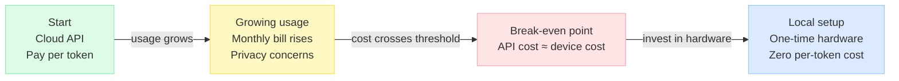
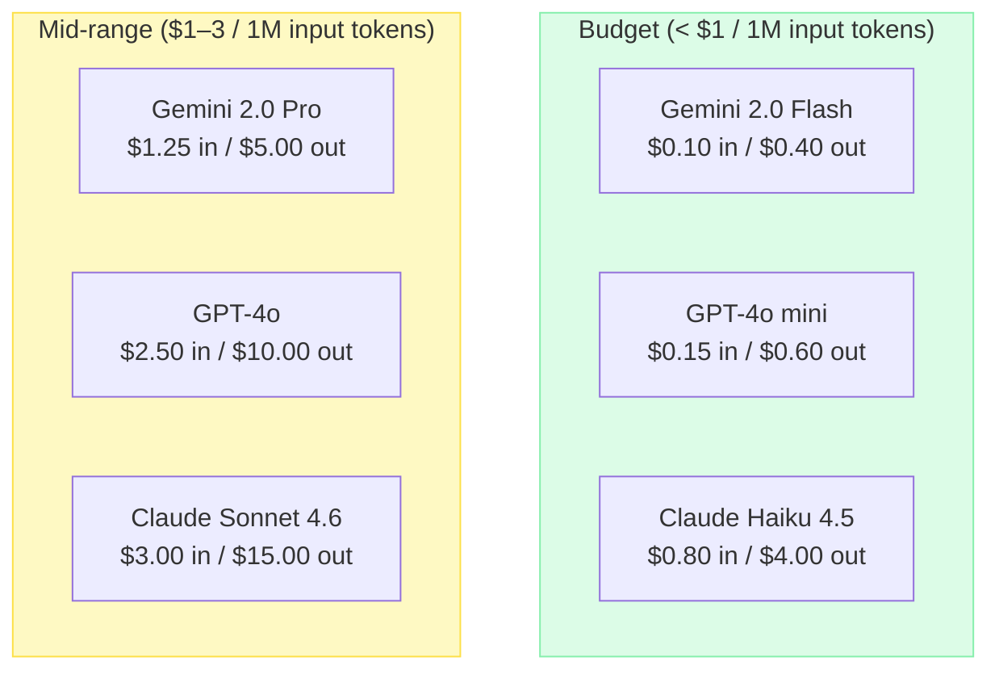
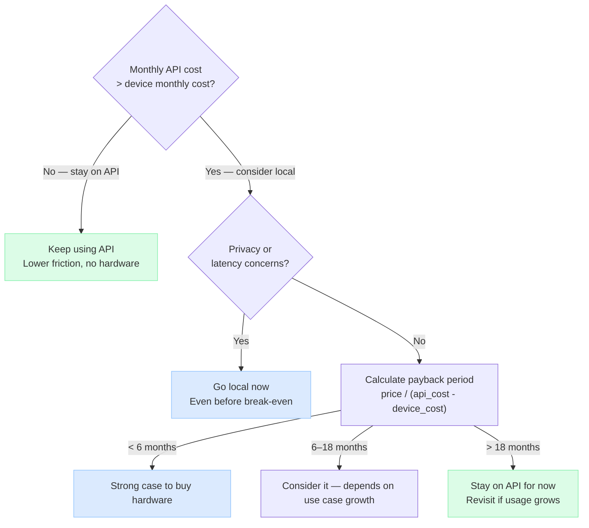
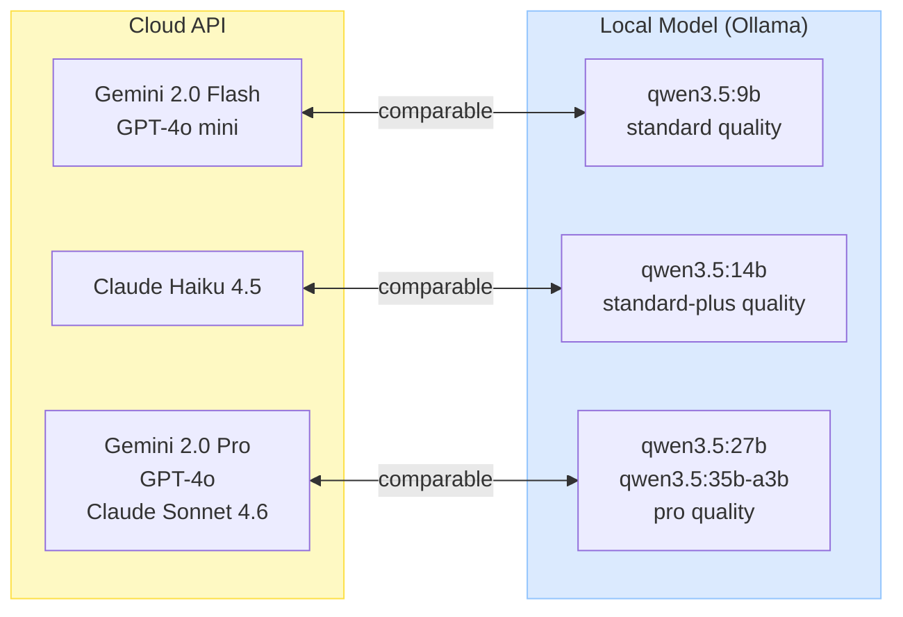
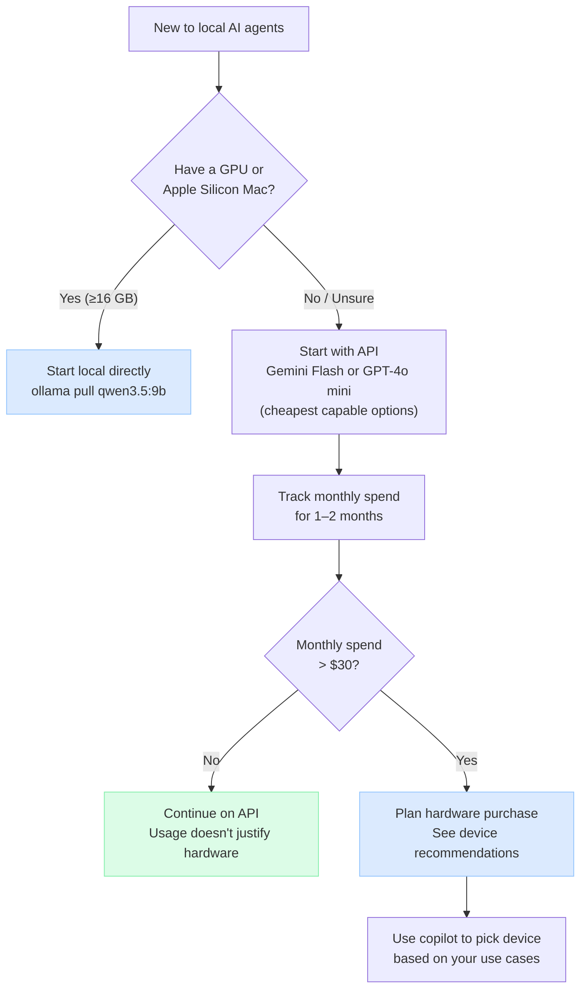

# Cost Guide — API vs Local

> This guide helps you estimate your LLM costs and decide
> when it makes sense to transition from cloud APIs to a local setup.

---

## The Journey

Most users start with a cloud API (no hardware cost, instant setup)
and move toward local models as their usage grows.



---

## API Service Tiers



---

## Estimating Your Monthly Cost

### Token usage by use case

| Use case | Tokens / day (typical) | Tokens / day (heavy) |
|----------|------------------------|----------------------|
| `general_qa` | 20K | 100K |
| `code_generation` | 80K | 300K |
| `web_automation` | 150K | 500K |
| `document_rag` | 100K | 400K |
| `web_research` | 200K | 600K |
| `agent_monitoring` | 300K | 1M+ |
| `multi_agent` | 500K | 2M+ |

> Tokens = input + output. Agent tasks tend to be input-heavy (tool call context).
> Assume ~60% input / 40% output for agent workloads.

### Monthly cost formula

```
monthly_tokens = tokens_per_day × 30
input_tokens   = monthly_tokens × 0.60
output_tokens  = monthly_tokens × 0.40

monthly_cost   = (input_tokens / 1,000,000 × input_price)
               + (output_tokens / 1,000,000 × output_price)
```

### Example: code_generation, typical usage (80K tokens/day)

| API | Monthly cost |
|-----|-------------|
| Gemini 2.0 Flash | $0.14 + $0.38 = **$0.52** |
| GPT-4o mini | $0.22 + $0.58 = **$0.79** |
| Claude Haiku 4.5 | $1.15 + $3.84 = **$4.99** |
| GPT-4o | $3.60 + $9.60 = **$13.20** |
| Claude Sonnet 4.6 | $4.32 + $14.40 = **$18.72** |

### Example: agent_monitoring, heavy usage (1M tokens/day)

| API | Monthly cost |
|-----|-------------|
| Gemini 2.0 Flash | **$54** |
| GPT-4o mini | **$99** |
| Claude Haiku 4.5 | **$624** |
| GPT-4o | **$1,650** |
| Claude Sonnet 4.6 | **$2,340** |

At this scale, local hardware pays for itself within weeks.

---

## Break-Even Calculator

### Device monthly cost (2-year amortization)

| Device | Price | Monthly cost |
|--------|-------|-------------|
| Mac Mini M4 16GB | ~$600 | **$25** |
| Mac Mini M4 32GB | ~$750 | **$31** |
| Mac Mini M4 Pro 24GB | ~$1,300 | **$54** |
| PC + RTX 4060 8GB | ~$400 (GPU only) | **$17** |
| PC + RTX 4090 24GB | ~$2,000 (GPU only) | **$83** |

> Electricity: ~$2–5/month for Mac Mini, ~$10–20/month for high-end PC.

### Break-even point



---

## Local vs API: Quality Mapping

Each API service maps to a comparable local model.
Quality is equivalent for most agent tasks; the main difference is speed and privacy.



---

## Recommended Starting Path



---

## Tips

- **Start cheap**: Gemini 2.0 Flash is the lowest cost entry point with good quality.
- **Track tokens**: Most API dashboards show daily token usage. Check after 1 week.
- **Agent tasks cost more**: Tool calls add input tokens. Expect 2-5× more tokens than simple chat.
- **Privacy threshold**: If you're processing sensitive data, local setup is worth it regardless of cost.
- **MoE advantage**: Local MoE models (qwen3.5:35b-a3b) punch above their weight — `pro` quality at `standard` running cost.
