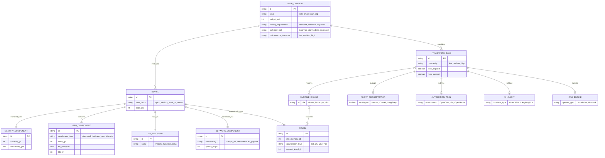
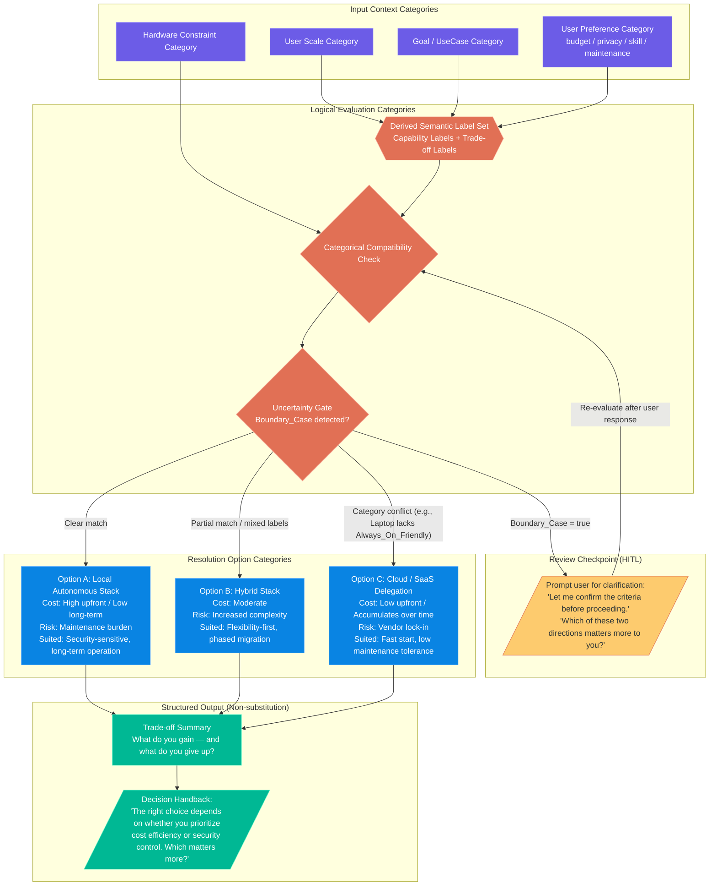

# Agent Setup Ontology: 3-Layer Architecture Schemas

This document visualizes the schema and data flow of the core 3-layer architecture (Fact → Semantic → Decision) for `agent-setup-copilot` and the `agent-setup-ontology`.

> **Policy anchor:** This schema structurally reflects the Non-Substitution Principle from `advisory-decision-support-policy`. The Decision Layer does not output a single conclusion — it returns structured options and trade-offs to the user for final judgment.

---

## 1. Fact Layer (Componentized Entity Schema)

**Role:** Defines the abstract schema (Classes/Attributes) for hardware, software, and **user context** entities.
- *Design Update:* Devices and Frameworks are not monolithic blocks. They are broken down into specific operational components and architectural subtypes, capturing the full complexity of the local AI ecosystem.
- *Policy Update:* `USER_CONTEXT` entity added — budget, privacy requirement, technical skill, and operational scale are explicitly modeled at the Fact level. These values feed directly into Semantic Label derivation.

---

## 2. Semantic Layer (Labeling Entities & Property Graph)

**Role:** Acts as a **Labeling Entity** layer (`semantic_labels.yaml`). It translates raw, mechanical combinations of Fact elements into human-meaningful semantic labels.
- These tags/labels serve as the bridging properties that the Decision Layer later evaluates.
- *Policy Update:* Labels are structured as **dual-sided** — capability labels and trade-off labels. Capability-only labels create option collapse risk. Every major capability label is paired with a corresponding trade-off label.
- *Policy Update:* Boundary cases where derivation conditions are not clearly met are marked `Uncertain`, and are handled via a review checkpoint in the Decision Layer.

```mermaid
flowchart TD
    subgraph FactBase["Fact Layer Variables"]
        D[Device Form Factor]:::fact
        M[Memory & Speed]:::fact
        P[Price Benchmark]:::fact
        OS[OS Architecture]:::fact
        NET[Network Connectivity]:::fact
        UC[User Context<br/>scale / budget / privacy / skill]:::fact
    end

    subgraph SemanticLabels["Semantic Labeling Entities (semantic_labels.yaml)"]
        direction TB
        subgraph Positive["Capability Labels"]
            AO{{Always_On_Friendly}}:::semantic
            CE{{Cost_Effective}}:::semantic
            PT{{Portable_Ready}}:::semantic
            MF{{Maintenance_Free}}:::semantic
            HS{{High_Security_Compliance}}:::semantic
            SC{{Scale_Capable}}:::semantic
            DS{{Data_Sovereignty_Control}}:::semantic
        end
        subgraph Tradeoff["Trade-off / Risk Labels"]
            HUC{{High_Upfront_Cost}}:::tradeoff
            VLR{{Vendor_Lock_Risk}}:::tradeoff
            TB{{Team_Scale_Bottleneck}}:::tradeoff
            HMB{{High_Maintenance_Burden}}:::tradeoff
            HFC{{High_Flexibility_Ceiling}}:::tradeoff
        end
        subgraph Uncertain["Uncertainty Markers"]
            UNK{{Uncertain: Boundary_Case}}:::uncertain
        end
    end

    %% Capability label derivations
    D -- "Mini-PC/Server form factor" --> AO
    D -- "Laptop form factor" --> PT
    UC -- "privacy_requirement = sensitive|regulated" --> HS
    UC -- "privacy_requirement = sensitive|regulated" --> DS
    OS -- "macOS pre-compiled/Unix" --> MF
    UC -- "scale = small_team|org AND Memory >= 32GB" --> SC
    P -- "High-tier perf AND price < 1000 USD" --> CE

    %% Trade-off label derivations (paired with capabilities)
    D -- "Server/dedicated hardware → local infra cost" --> HUC
    UC -- "scale > 1 AND memory < 32GB" --> TB
    OS -- "Custom Linux / bare-metal setup" --> HMB
    UC -- "SaaS dependency path selected" --> VLR
    UC -- "technical_skill = advanced" --> HFC

    %% Uncertainty cases
    UC -- "budget boundary OR skill=intermediate AND privacy=sensitive" --> UNK

    classDef fact fill:#2d3436,color:#fff,stroke:#636e72;
    classDef semantic fill:#00b894,color:#fff,stroke:#55efc4;
    classDef tradeoff fill:#e17055,color:#fff,stroke:#fab1a0;
    classDef uncertain fill:#fdcb6e,color:#2d3436,stroke:#e17055;
```

*Semantic Property Tracing: Raw fact combinations do not make decisions on their own. `deo_resolver.py` evaluates Facts and attaches both Capability Labels and Trade-off Labels. The LLM Copilot uses both label sets together to construct structured options.*

---

## 3. Decision Layer (Categorical Resolution Schema)

**Role:** The Decision Layer is modeled as a **multi-option categorical framework**. It does not output a single conclusion — instead, it produces a **structured option set with trade-off summaries**, returning final judgment to the user.

> **Policy constraint:** This layer does not steer the user toward a specific conclusion. Matching results are composed into an option structure. Where uncertainty exists, a review checkpoint is inserted. Final judgment is handed back to the user.

### Summary: Categorical Routing (Single to Team Transition)

1. **Input Category Shift:** User transitions `User Scale Category` from Single to Team.
2. **Semantic Label Derivation:** This shift demands `Always_On_Friendly` + `Scale_Capable` label presence, and flags `Team_Scale_Bottleneck` risk if memory < 32GB.
3. **Uncertainty Gate:** If hardware constraint is borderline (e.g., 16GB laptop), `Boundary_Case` is flagged — a review checkpoint is inserted before routing.
4. **Multi-option Resolution:** Rather than binary routing, the system produces:
   - **Option A (Local):** if hardware fully satisfies label requirements
   - **Option B (Hybrid):** if partial match — e.g., local for inference, cloud for scale-out
   - **Option C (Cloud):** if hardware category conflicts with required semantic labels
5. **Trade-off Output:** Each option is accompanied by cost/risk/fit dimensions — not a conclusion, but a decision map.
6. **Decision Handback:** Final routing is not decided by the system. The structured output is returned to the user with explicit judgment criteria.

---

## 4. Policy Compliance Checklist

Verifies that this schema satisfies the requirements of `advisory-decision-support-policy`.

| Policy Item | Reflected In | Status |
|-------------|--------------|--------|
| No single-answer recommendation | Decision Layer → 3-option structure | ✅ |
| Decision frame made explicit | Review Checkpoint node | ✅ |
| Uncertainty not hidden | Uncertainty Gate + Boundary_Case label | ✅ |
| Option structure provided (2–3 options) | Option A/B/C Resolution Categories | ✅ |
| Trade-offs made explicit | Trade-off / Risk Labels (Semantic) + Trade-off Summary (Decision) | ✅ |
| Review checkpoint present | Review Checkpoint (HITL) node | ✅ |
| Decision handback to user | Decision Handback output node | ✅ |
| USER_CONTEXT modeled at Fact level | Fact Layer USER_CONTEXT entity | ✅ |
