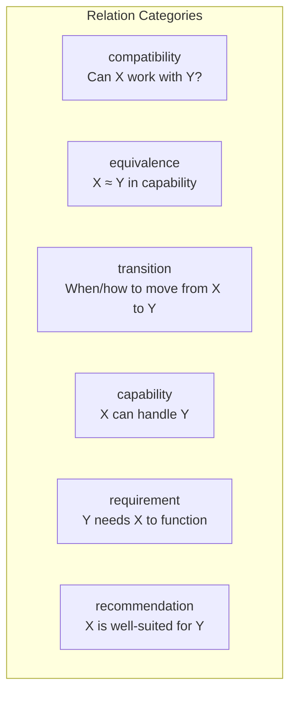
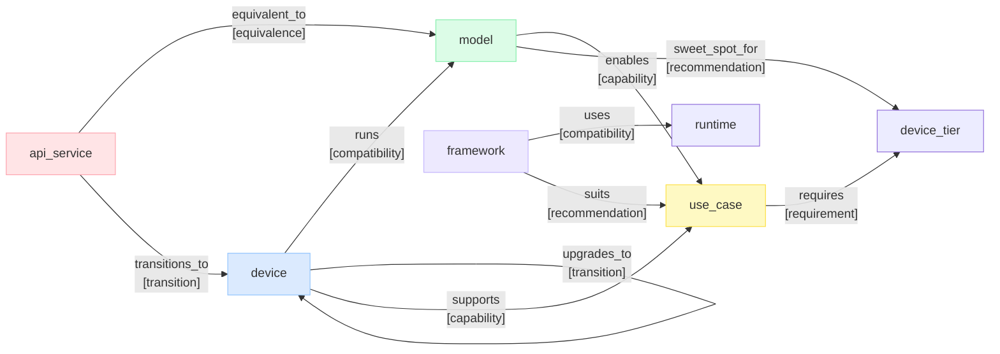
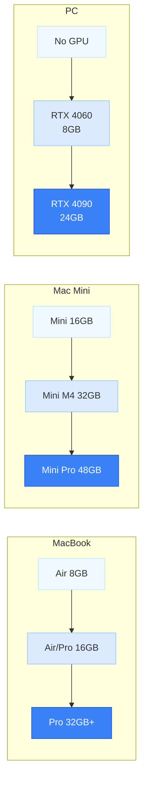
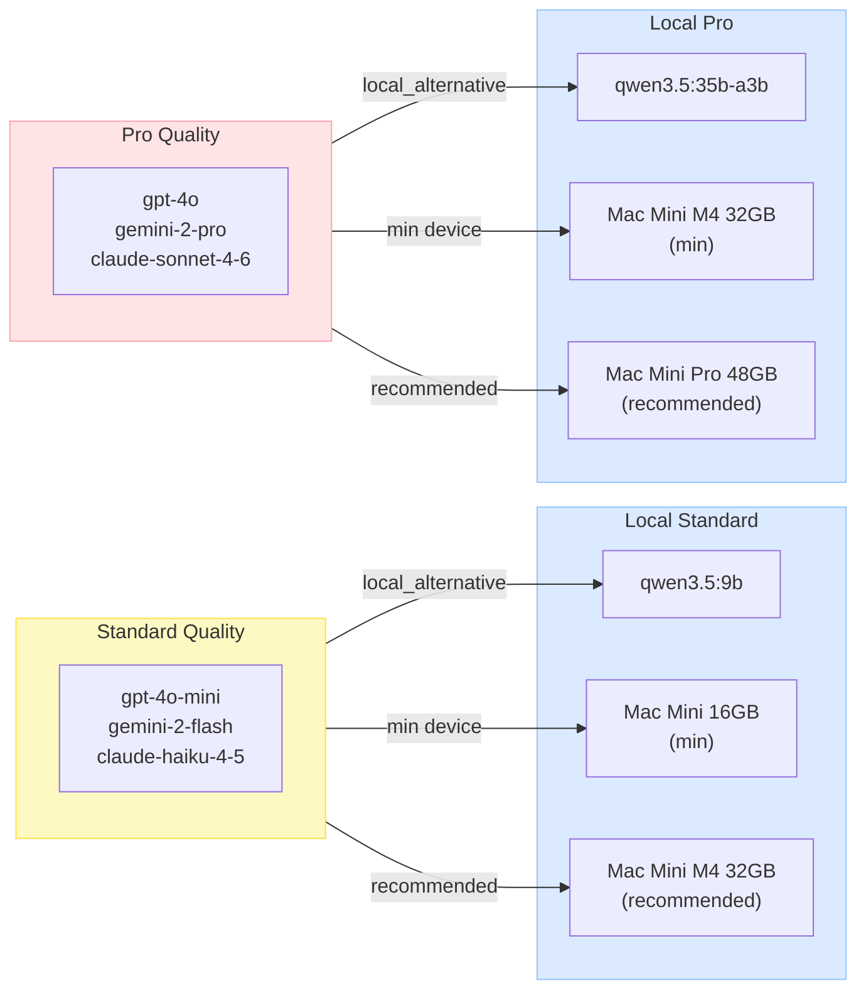
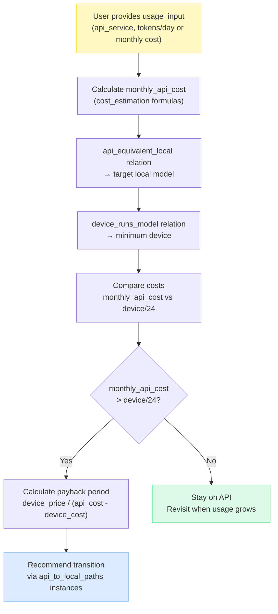

# Relations Reference

> Machine-readable source: [`../relations.yaml`](../relations.yaml)
> Version: 0.0.1 — foundational data only

Relations describe **how entities connect to each other** in the ontology.
Most relations are derivable from the data; a few are stored as explicit instances.

---

## Relation Category Taxonomy

---

## All Relation Types

---

## Derivable vs Explicit

| Relation | Derivable? | Source |
|----------|-----------|--------|
| `device_runs_model` | ✅ auto | `device.memory_gb >= model.min_memory_gb` |
| `framework_uses_runtime` | ✅ stored | `framework.runtime_support[]` |
| `api_equivalent_local` | ✅ stored | `api_service.local_alternative` |
| `api_transitions_to_device` | ✅ auto + instances | derivation + `relations.yaml` instances |
| `device_upgrades_to` | 📋 instances | `relations.yaml` upgrade_paths |
| `model_enables_use_case` | ✅ auto | `model.quality` + `model.tool_calling` |
| `device_supports_use_case` | ✅ auto | `device.memory_gb` + `use_case.min_memory_gb` |
| `use_case_requires_tier` | ✅ auto | `use_case.min_memory_gb` mapping |
| `framework_suits_use_case` | ✅ stored | `framework.best_for[]` |
| `model_sweet_spot_for_tier` | ✅ stored | `model.sweet_spot` |

---

## Device Upgrade Paths (explicit instances)

---

## API → Local Transition Paths (explicit instances)

---

## Usage-Based Transition Flow

When the user provides their usage data, the copilot uses relations to reason:

