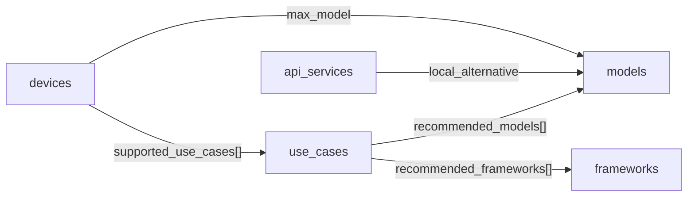
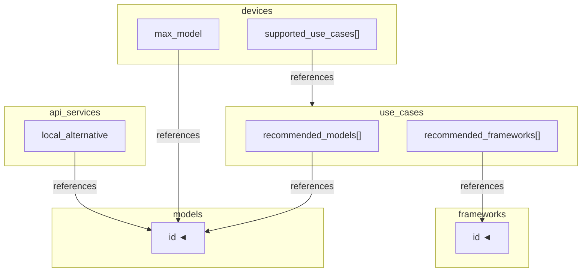

# Schema Reference

> **Structural contract (required fields, types, enums)**
> is owned by [`agent-setup-copilot/governance/`](https://github.com/WMJOON/agent-setup-copilot/tree/main/governance).
>
> **Semantic definitions (what values mean)**
> are in [`concepts.yaml`](../concepts.yaml) in this repo.

---

## Overview

`ontology.yaml` defines six entity types:

```
ontology.yaml
├── use_cases[]     What goals users want to accomplish
├── devices[]       Complete machines (Mac, pre-built PC, laptops)
├── components[]    PC hardware parts (GPU cards, RAM kits) for custom builds
├── models[]        Ollama-pullable LLMs
├── frameworks[]    Tools for building, running, or interacting with agents
└── api_services[]  Cloud LLM APIs — starting point before going local
```

**devices vs components:**
Mac devices are complete, fixed-spec products.
PC users choose components (GPU + RAM) to build a custom setup.
The copilot recommends either a complete device or a component combination
depending on the user's platform preference.

Entities are linked by cross-references:



---

## Entity: `use_case`

A goal the user wants to accomplish with a local AI agent.

| Field | Required | Type | Constraints |
|-------|----------|------|-------------|
| `id` | ✅ | string | `[a-z0-9_.:‑]+` |
| `label` | ✅ | string | Human-readable name |
| `description` | ✅ | string | One-line summary |
| `keywords` | ✅ | string[] | ≥1 item. Used for intent matching |
| `min_memory_gb` | ✅ | integer | ≥0 |
| `needs_always_on` | — | boolean | True → prefer stationary device |
| `requires_gpu` | — | boolean | True → discrete GPU strongly preferred |
| `recommended_models` | — | string[] | References `models[*].id` |
| `recommended_frameworks` | — | string[] | References `frameworks[*].id` |

**Example:**

```yaml
- id: web_automation
  label: "Web Automation"
  description: "Autonomous browser control, scraping, form filling"
  keywords: [OpenClaw, browser, scraping, automation, web]
  min_memory_gb: 16
  needs_always_on: false
  recommended_models: [qwen3.5:9b, qwen3.5:35b-a3b]
  recommended_frameworks: [openclaw, smolagents]
```

---

## Entity: `device`

A physical machine capable of running a local LLM via Ollama.

| Field | Required | Type | Constraints |
|-------|----------|------|-------------|
| `id` | ✅ | string | `[a-z0-9_.:‑]+` |
| `label` | ✅ | string | |
| `type` | ✅ | enum | `macbook` \| `mac-mini` \| `mac-studio` \| `pc` \| `other` |
| `memory_gb` | ✅ | integer | ≥1 |
| `tier` | ✅ | enum | `light` \| `standard` \| `standard-plus` \| `pro` |
| `max_model` | ✅ | string | References `models[*].id` |
| `chip` | — | string | e.g. `M4`, `M4 Pro`, `Intel i9` |
| `memory_bandwidth_gbs` | — | number | Peak bandwidth in GB/s |
| `gpu_vram_gb` | — | integer | 0 if no discrete GPU |
| `portability` | — | enum | `portable` \| `stationary` |
| `always_on` | — | boolean | |
| `price_range` | — | string | Approximate cost string |
| `note` | — | string | One-line description |
| `best_for` | — | string | Short sentence on primary use |
| `supported_use_cases` | — | string[] \| `"all"` | References `use_cases[*].id`, or literal `"all"` |
| `unsupported_use_cases` | — | string[] | References `use_cases[*].id` |

**`tier` quick reference** (→ see `concepts.yaml` for full definitions):

| Tier | Memory | Representative model |
|------|--------|---------------------|
| `light` | ≤8 GB | qwen3.5:4b |
| `standard` | 16 GB | qwen3.5:9b |
| `standard-plus` | 32 GB (base chip) | qwen3.5:35b-a3b |
| `pro` | 32 GB+ high-BW, or 24 GB+ GPU | qwen3.5:27b / 32b |

**Example:**

```yaml
- id: mac_mini_m4_32gb
  label: "Mac Mini M4 32GB"
  type: mac-mini
  chip: M4 (base)
  memory_gb: 32
  memory_bandwidth_gbs: 120
  gpu_vram_gb: 0
  portability: stationary
  always_on: true
  price_range: "~$750"
  tier: standard-plus
  max_model: qwen3.5:35b-a3b
  best_for: "Best price-to-capability always-on AI server"
  supported_use_cases: all
  unsupported_use_cases: [fine_tuning]
```

---

## Entity: `model`

An Ollama-pullable LLM. The `id` is the exact `ollama pull` tag.

| Field | Required | Type | Constraints |
|-------|----------|------|-------------|
| `id` | ✅ | string | Exact Ollama tag, e.g. `qwen3.5:9b` |
| `label` | ✅ | string | |
| `params_b` | ✅ | number | Total parameters in billions |
| `type` | ✅ | enum | `dense` \| `MoE` |
| `min_memory_gb` | ✅ | integer | Minimum RAM to run at practical speed |
| `quality` | ✅ | enum | `light` \| `standard` \| `standard-plus` \| `pro` |
| `tool_calling` | ✅ | boolean | Reliable structured tool/function call support |
| `active_params_b` | — | number | MoE only: active params per forward pass |
| `speed_note` | — | string | Representative speed on reference hardware |
| `sweet_spot` | — | boolean | Best quality-to-resource ratio in its tier |
| `note` | — | string | One-line description |

**`quality` quick reference** (→ see `concepts.yaml` for full definitions):

| Quality | Scale | Typical use |
|---------|-------|------------|
| `light` | 1–4B | Autocomplete, simple Q&A |
| `standard` | 7–9B | Most single-agent tasks |
| `standard-plus` | ~14B | Code review, nuanced reasoning |
| `pro` | 27B+ | LLM-as-Judge, multi-agent |

**Example:**

```yaml
- id: qwen3.5:35b-a3b
  label: "qwen3.5:35b-a3b"
  params_b: 35
  active_params_b: 3
  type: MoE
  min_memory_gb: 32
  quality: pro
  tool_calling: true
  speed_note: "~18-25 t/s on Mac Mini M4 32GB"
  sweet_spot: true
  note: "MoE sweet spot: 35B quality, 3B active params. Best pick for 32GB devices."
```

---

## Entity: `framework`

A tool for building, running, or interacting with a local AI agent.

| Field | Required | Type | Constraints |
|-------|----------|------|-------------|
| `id` | ✅ | string | `[a-z0-9_.:‑]+` |
| `label` | ✅ | string | |
| `kind` | ✅ | enum | `agent` \| `automation` \| `ui` \| `ide` \| `rag` |
| `complexity` | ✅ | enum | `low` \| `medium` \| `high` |
| `local_capable` | ✅ | boolean | Can run without any API key using Ollama |
| `runtime_support` | ✅ | string[] | ≥1 item from allowed set (see below) |
| `multiagent` | — | boolean | Supports multi-agent collaboration |
| `mcp_support` | — | boolean | Supports Model Context Protocol |
| `install` | — | string | Installation command or URL |
| `best_for` | — | string[] | References `use_cases[*].id` |
| `note` | — | string | One-line description |

**`kind` quick reference** (→ see `concepts.yaml` for full definitions):

| Kind | Role | Examples |
|------|------|---------|
| `agent` | Orchestrates tools + memory + reasoning | smolagents, crewai, langgraph |
| `automation` | LLM-powered desktop/browser automation | openclaw |
| `ui` | Chat front-end, no coding | open-webui, anythingllm |
| `ide` | Editor inline copilot | continue |
| `rag` | Document retrieval + Q&A | llamaindex |

**`runtime_support` allowed values:**

| Value | Meaning |
|-------|---------|
| `ollama` | Local Ollama — no API key, fully private |
| `openai` | OpenAI API |
| `anthropic` | Anthropic API |
| `huggingface` | HuggingFace Inference / Transformers |
| `litellm` | Universal proxy (100+ providers) |
| `any` | Any OpenAI-compatible endpoint |

**Example:**

```yaml
- id: openclaw
  label: "OpenClaw"
  kind: automation
  complexity: medium
  local_capable: true
  runtime_support: [ollama, openai, anthropic]
  multiagent: false
  mcp_support: false
  install: "https://github.com/openclaw/openclaw"
  best_for: [web_automation]
  note: "Autonomous browser, file, and code execution. LLM-powered desktop automation."
```

---

## Entity: `component`

An individual hardware part for PC builds. Prices are not hardcoded —
use `price_search_query` with a web search tool for current pricing.

| Field | Required | Type | Constraints |
|-------|----------|------|-------------|
| `id` | ✅ | string | `[a-z0-9_.:‑]+` |
| `label` | ✅ | string | |
| `component_type` | ✅ | enum | `gpu` \| `cpu` \| `memory` |
| `inference_tier` | ✅ | enum | `light` \| `standard` \| `standard-plus` \| `pro` |
| `price_search_query` | ✅ | string | Web search query for current price |
| `vram_gb` | — | integer | GPU only: VRAM in GB |
| `memory_bandwidth_gbs` | — | number | GPU only: bandwidth in GB/s |
| `tdp_w` | — | integer | GPU: thermal design power in watts |
| `architecture` | — | string | GPU: chip architecture name |
| `capacity_gb` | — | integer | Memory only: total capacity |
| `generation` | — | string | Memory only: DDR4 / DDR5 |
| `llm_perf_note` | — | string | Representative inference speed note |

**GPU `inference_tier` by VRAM:**

| VRAM | Tier | Representative max model |
|------|------|--------------------------|
| 8 GB | `standard` | qwen3.5:9b (Q4) |
| 12 GB | `standard` | qwen3.5:9b fast |
| 16 GB | `standard-plus` | qwen3.5:14b (Q4) |
| 24 GB | `pro` | qwen3.5:27b (Q4) |
| 32 GB | `pro` | qwen3.5:32b (Q4) |

**Example:**

```yaml
- id: rtx-4090
  label: "NVIDIA GeForce RTX 4090"
  component_type: gpu
  vram_gb: 24
  memory_bandwidth_gbs: 1008
  tdp_w: 450
  architecture: ada-lovelace
  inference_tier: pro
  llm_perf_note: "~40-50 t/s for 27B Q4. Runs 32B dense in VRAM."
  price_search_query: "NVIDIA RTX 4090 24GB GPU price"
```

---

## Entity: `api_service`

A cloud LLM API as a cost-effective starting point before investing in local hardware.
See [`cost-guide.md`](./cost-guide.md) for break-even calculation.

| Field | Required | Type | Constraints |
|-------|----------|------|-------------|
| `id` | ✅ | string | `[a-z0-9_.:‑]+` |
| `label` | ✅ | string | |
| `provider` | ✅ | enum | `anthropic` \| `openai` \| `google` \| `mistral` \| `cohere` \| `other` |
| `quality` | ✅ | enum | Same as models: `light` \| `standard` \| `standard-plus` \| `pro` |
| `tool_calling` | ✅ | boolean | Supports structured tool/function calls |
| `pricing` | ✅ | object | `input_per_1m`, `output_per_1m` (USD per 1M tokens) |
| `context_window_k` | — | integer | Max context in K tokens |
| `local_alternative` | — | string | References `models[*].id` — comparable local model |
| `note` | — | string | One-line description |

**Example:**

```yaml
- id: claude-haiku-4-5
  label: "Claude Haiku 4.5"
  provider: anthropic
  quality: standard
  tool_calling: true
  context_window_k: 200
  pricing:
    input_per_1m: 0.80
    output_per_1m: 4.00
    currency: USD
    source: "https://www.anthropic.com/pricing"
  local_alternative: "qwen3.5:9b"
  note: "Fastest Anthropic model. Best cost-per-task for simple agents."
```

---

## Ontology Layer Structure

Ontology nodes are stratified into three layers. The dependency direction is always
`Fact → Semantic → Decision`.

### Layer: `fact`

Objective, verifiable properties. Qualitative classes require a `rubric_ref`.

| Field | Required | Description |
|-------|----------|-------------|
| `layer` | ✅ | Must be `fact` |
| `domain` | ✅ | e.g. `device`, `model`, `setup` |
| `entity_id` | ✅ | Matches the instance id in `instances/` |
| `raw_facts` | — | Directly measured numeric values |
| `normalized_facts` | — | Rubric-bound class values (each must carry `rubric_ref`) |
| `evidence_refs` | ✅ | ≥1 source reference (wikilink or URL) |

**Must not contain:** recommendation language, persona fit judgements.

```yaml
# concepts/fact/devices/mac-mini.md
---
layer: fact
domain: device
entity_id: mac-mini
raw_facts:
  max_noise_level_db: 32        # integer, dB
  idle_power_w: 15              # integer, watts
  gpu_expandability_slots: 0    # integer, count
normalized_facts:
  noise_class:
    value: low
    rubric_ref: "[[rubrics/noise-class]]"
  power_efficiency_class:
    value: high
    rubric_ref: "[[rubrics/power-efficiency-class]]"
evidence_refs:
  - "[[sources/mac-mini-spec]]"
---
```

---

### Layer: `semantic`

Reusable interpretations derived from one or more Fact nodes.
Must not reference user goals or constraints directly.

| Field | Required | Description |
|-------|----------|-------------|
| `layer` | ✅ | Must be `semantic` |
| `domain` | ✅ | e.g. `device`, `model`, `setup` |
| `semantic_id` | ✅ | Snake-case concept name (e.g. `quiet_always_on_friendly`) |
| `derived_from` | ✅ | ≥1 wikilink to Fact nodes |
| `interprets` | — | Which Fact fields this concept interprets |
| `criteria` | — | Threshold conditions on normalized Fact classes |
| `meaning` | ✅ | One-line human-readable interpretation |

**Must not contain:** direct recommendation sentences, user-condition branching.

```yaml
# concepts/semantic/devices/quiet-always-on-friendly.md
---
layer: semantic
domain: device
semantic_id: quiet_always_on_friendly
derived_from:
  - "[[concepts/fact/devices/mac-mini]]"
interprets:
  - noise_class
  - power_efficiency_class
criteria:
  noise_class: low
  power_efficiency_class: high
meaning: 낮은 소음과 전력 부담으로 상시 구동에 유리함
---
```

---

### Layer: `decision`

Context-conditional judgements applied on top of Semantic concepts.
Every decision node must have `applies_when` and at least one `incorporates` reference.

| Field | Required | Description |
|-------|----------|-------------|
| `layer` | ✅ | Must be `decision` |
| `domain` | ✅ | e.g. `device`, `model`, `setup` |
| `decision_id` | ✅ | Snake-case pattern name |
| `incorporates` | ✅ | ≥1 wikilink to Semantic nodes |
| `applies_when` | ✅ | Structured user context (`goals`, `constraints`, `preferences`) |
| `outcome` | ✅ | `prefer` / `avoid` / `trade_off` with target reference |
| `rationale_template` | ✅ | One-line rationale (no free-form recommendation) |

**Must not contain:** source-free factual claims, Semantic-free conclusions.

```yaml
# concepts/decision/devices/prefer-for-low-maintenance-research.md
---
layer: decision
domain: device
decision_id: prefer_for_low_maintenance_research
incorporates:
  - "[[concepts/semantic/devices/quiet-always-on-friendly]]"
  - "[[concepts/semantic/devices/low-operational-friction]]"
applies_when:
  goals:
    - ontology_heavy_research
  constraints:
    maintenance_tolerance: low
    noise_sensitivity: medium_or_higher
outcome:
  prefer: "[[instances/fact/devices/mac-mini]]"
rationale_template: 낮은 운영 마찰과 상시 구동 적합성이 중요할 때 우선 후보
---
```

---

### Linking Mechanics

Canonical links flow downward only. Reverse links are derived by rollup pipelines.

```
Semantic.derived_from    → Fact node
Semantic.interprets      → Fact field or Fact node
Decision.incorporates    → Semantic node
Decision.applies_when    → User Context schema
Decision.outcome         → Target entity / setup / option
```

### Validation Rules

| Check | Severity |
|-------|----------|
| Fact node missing `evidence_refs` | error |
| Fact node contains recommendation language | error |
| Semantic node missing `derived_from` | error |
| Semantic node contains user-condition branching | warning |
| Decision node missing `incorporates` | error |
| Decision node missing `applies_when` | error |
| Decision node has no `rationale_template` | error |

---

## Cross-Reference Diagram



All cross-references are validated by
[`agent-setup-copilot/governance/scripts/validate.py`](https://github.com/WMJOON/agent-setup-copilot/blob/main/governance/scripts/validate.py).
